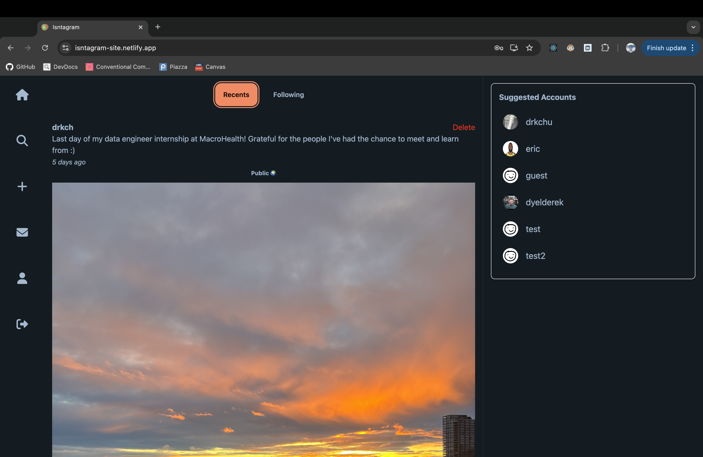

# Isntagram

This is a custom social media site to see what's going on with your friends. Built with React. Click [here](https://isntagram-site.netlify.app/) for the live app!

 Note: After inactivity, expect delays before logging in to the homepage before the DB spins back up again. Be patient!

Here's the [backend](https://github.com/drkchu/isntagram-api) repo

## 🚀 Features
- **User Authentication:** Secure login and registration with JWT-based authentication, including GitHub OAuth.
- **Posting:** Users can create posts with images, captions, and view posts from other users.
- **Real-Time Messaging:** Chat with friend(s) implemented with WebSockets.
- **Follow System:** Users can follow and unfollow other users.

## 📸 Screenshots

### Profile Page


### Real-Time Messaging


## 🛠️ Technologies Used
- **Frontend:** React (with React Router and React Query)
- **State Management:** React Query
- **Styling:** Tailwind CSS + DaisyUI
- **Authentication:** JWT (JSON Web Tokens) with GitHub OAuth
- **API Integration:** Axios for handling API requests
- **Real-Time Messaging:** WebSockets
- **Hosting:** Netlify for the frontend and Render for the backend

## 📦 Project Structure
```plaintext
src
├── api          # Axios API setup
├── components   # Reusable components
├── context      # Context providers
├── pages        # Page components (Login, Profile, etc.)
├── services     # Business logic services
├── styles       # Tailwind CSS configurations
├── App.js       # Main app component and routing
└── index.js     # React DOM rendering
```

## 📦 How to Run Locally
1. Clone the repository:
   ```bash
   git clone https://github.com/drkchu/isntagram.git
   cd instagram-frontend
   ```
2. Install dependencies:
   ```bash
   npm install
   ```
3. Create a `.env` file and set:
   ```plaintext
   REACT_APP_API_URL=[your_backend_url]
   ```
4. Run the app:
   ```bash
   npm start
   ```

## ✅ Future additions and optimizations
- Allow users to take their own photos in app.
- Optimize image uploads with compression.